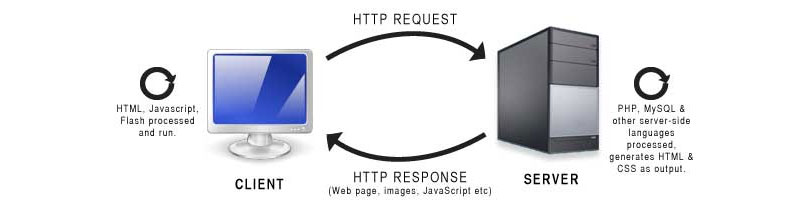

 

 

Quick Introduction to HTTP
=====================
HTTP for Beginners
=====================
Beginners introduction to HTTP
=====================

Description
---------------------

Let us learn/understand the essentials and basic concepts of HTTP (HyperText Transfer Protocol)

This tutorial, reference/learning material is for beginners who do not have any understandings about HTTP. Here will cover the fundamental concepts of HTTP.

Topics (separate with spaces)
---------------------

Add topics to categorize your repository and make it more discoverable:

- http
- hypertext-transfer-protocol
- web-server
- webserver
- client
- client-server
- http2
- http-methods
- get-post-put-delete-methods
- http-vs-https
- https
- protocols
- request-response
- ip-tcp
- http-responce-code
- 200-400-500
- stateless
- http-communication-request-response
- protocols-ip-tcpip-smtc-http-ftp
- http-architecture-mechanism

Welcome
---------------------

Hi All, I'm **`Dinanath Jayaswal, Senior UI/Web Developer and Adobe Certified Expert Professional`**, I wanna welcome you to the `Quick Introduction to HTTP`.

About the Course/Tutorial
---------------------

What will learn and cover
---------------------

Welcome to the new tutorial on HTTP (HyperText Transfer Protocol). 

In this introductory HTTP module will have a look and learn:
- What is HTTP
- HTTP Communication - Request & Response
- HTTP Methods
- Status Code

Who is this for? Audience
---------------------

This Course/Tutorial is ideal for: 
- Freshers
- Intermediates
- Beginner Programmers
- Any Developer/Designer
- Web Designers and Developers, Front-End/UI Designers and Developers

Course/Tutorial achievement
---------------------
Course/Tutorial Goal
---------------------

After completing/attending/finishing this Course/Tutorial, participants should be able to: 
- Understand HTTP basics/fundamentals

Prerequisites for current course / What you need to know
---------------------

- HTML5
- CSS3
- JavaScript
- Basics of any programming language
- Basic web development knowledge is useful but not required

Topics included/covered
=====================

1. [Introduction to HTTP](#1-introduction-to-http)
    - 1.1. [What is HTTP](#11-what-is-http)
    - 1.2. [Protocol](#12-protocol)
    - 1.3. [HTTP communication](#13-http-communication)
 

1 Introduction to HTTP
=====================

1.1. What is HTTP
---------------------

 <figure>
  
 </figure>

- HTTP stands for `HyperText Transfer Protocol`
- HTTP is a `set of rules and regulations ie. principles to accomplish Internet Communication/Data Transfer` related tasks on the web (between Servers an Clients)
- Responsible for `communication between Clients and Web Servers`
- HTTP is child protocol of TCP/IP
- HTTP is `stateless ie. every request is completely independent` (each request is a single transaction, does not remember or dependent on past/before request)
- HyperText Transfer Protocol (Internet Communication/Data Transfer on the web). A set of rules (and a format) for data being transferred on the web in the form of HTML, image, audio, video, zip, etc.
- HTTP foundation of data communication for the World Wide Web/internet since 1990. HTTP is a generic and stateless protocol that can be used for other purposes as well as using extensions of its request methods, error codes, and headers

> As soon as User opens `Web Browser and enter URL`, the user is indirectly making use of HTTP. HTTP mechanism sends/transfer/transit `REQUEST` to the webserver and fetches the `RESPONSE`/data from the webserver

> Every time we open a browser - visit and load pages, Submit Form, Button click for Ajax calls

- **Hyper Text**
  - Looks like a normal text but have some special effects/formattings
  - HyperText simply means `"Text within Text"`. A text has a link within it, is a hypertext. HyperText is a way to link two or more web pages (HTML documents) with each other
  - Hypertext refers to how `Web pages (HTML documents) are linked together`. Thus, the link available on a webpage is called Hypertext
  - Structured Text with links to other parts of a text, usually a web page
  - Usually defined using an HTML - in combination with other web technologies like CSS, JavaScript, etc.

1.2. Protocol
---------------------

- `A set of rules/standards, two sides (client and server) agree on to use when communicating`
- Both the client and server are programmed to understand and use that particular set of rules (Its similar to two people from different countries agreeing on the same language to speak in)

| Protocol              | Description / Details       |
| --------------------- | --------------------------- |
| `IP`                  | **`Internet Protocol`**     |
| `TCP`                 | **`Transmission Control Protocol`**     |
| `HTTP`                | **`Hyper Text Transfer Protocol`**  (Internet Communication/Data Transfer on the web)    |
| `FTP`                 | **`File Transfer Protocol`** (Files)    |
| `SMTP`                | **`Simple Mail Transfer Protocol`** (Email)    |

1.3. HTTP communication
---------------------

**HTTP Communication in brief:**

**Client** 
Clients are often browsers (Chrome, Edge, Safari), but they can be any type of program or device

- Sends request (Request message)
- Waits for service to respond
- Once receives the reply from the server, displays results at client location/device

**Web Server** 
Servers are most often computers in the cloud  
`(Continuously listens for requests)`

- Accepts request send by client and redirects to a specific web site or web app
- Web site processes data
- The web server receives a reply from a web site and forwards it to the client (Response message)

  <figure>
    &nbsp;&nbsp;&nbsp; 
    <figcaption>&nbsp;&nbsp;&nbsp; Image 1.3 - HTTP Client Server Architecture </figcaption>
  </figure>

